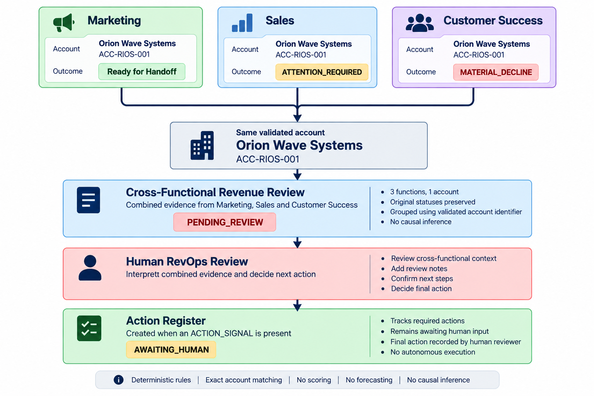

# Cross-Functional Revenue Review

**A cross-domain Revenue Intelligence / RevOps case study for bringing Marketing, Sales, and Customer Success signals into one traceable account-level review — while keeping the final business decision human.**

## Business Problem

Marketing, Sales, and Customer Success can each surface relevant outcomes for the same account.

When those outcomes are reviewed only inside their individual functional workflows, the broader Revenue context can remain fragmented. At the same time, simply combining records because they look related can create unreliable associations.

The business challenge is therefore to bring relevant cross-functional evidence together **only when a validated account identity supports the connection**, preserve where each signal came from, and give RevOps a shared context for review without turning co-occurrence into an automated conclusion.

## What the Solution Enables

Cross-Functional Revenue Review creates a common review layer above the three operational domains.

It enables the workflow to:

- bring Marketing, Sales, and Customer Success outcomes into a shared Revenue context;
- preserve each signal's original status and source provenance;
- associate signals only through validated account identity;
- identify which account-level situations require human review;
- keep informational or excluded evidence from creating unnecessary active review work;
- prepare an Action Register when action may be required;
- leave interpretation and the final business action to a human reviewer.

Revenue Intelligence / RevOps acts here as the **cross-functional coordination layer**. It is not a fourth operational domain.

## Synthetic Example: One Account, Three Functional Signals

The portfolio demonstration uses a fully synthetic account:

**Orion Wave Systems — `ACC-RIOS-001`**

Three independent functional outcomes are associated with that validated synthetic account:

| Function | Original outcome | Shared Revenue category |
|---|---|---|
| Marketing | `Ready for Handoff` | `ACTION_SIGNAL` |
| Sales | `ATTENTION_REQUIRED` | `ACTION_SIGNAL` |
| Customer Success | `MATERIAL_DECLINE` | `ACTION_SIGNAL` |

Instead of leaving these signals in three separate functional contexts, the system presents them together in one Revenue Review.

**Result**

- Review status: `PENDING_REVIEW`
- Source functions preserved: Marketing, Sales, Customer Success
- Action Register required: yes
- Action Register status: `AWAITING_HUMAN`
- Final action: not determined by the automation

The three signals appearing together **does not establish causation**. It establishes only that multiple relevant signals associated with the same validated synthetic account are available for cross-functional human review.

The public synthetic example also demonstrates the opposite case: matching display names alone are not enough to group records when reliable shared account identity is missing.

See [`examples/synthetic-example.json`](examples/synthetic-example.json).

## Who It Helps

The documented operational user is a **RevOps reviewer**.

Marketing, Sales, and Customer Success remain the source functions. RevOps receives the cross-functional context needed to review situations that span those functional boundaries.

## Decisions & Actions Supported

The automation supports preparation and routing rather than the final commercial decision.

It determines:

- whether evidence belongs to a valid shared account context;
- whether a Revenue Review item requires attention;
- whether an Action Register is required.

The human reviewer determines:

- how the combined evidence should be interpreted;
- whether cross-functional follow-up is appropriate;
- what the final business action should be.

This separation is deliberate: **the system organizes evidence; the human owns the consequential decision.**

## Potential Business Value

This pattern is designed to support:

- clearer account-level visibility across Revenue functions;
- less manual reconciliation of signals held in separate functional contexts;
- more traceable cross-functional review because original source evidence is preserved;
- more consistent routing of situations requiring attention;
- fewer unreliable account associations by avoiding fuzzy name matching;
- a structured starting point for RevOps coordination and follow-up.

These are **potential operational benefits demonstrated by the workflow design**, not measured client outcomes or ROI claims.

## Cross-Functional Revenue Review in Practice

The synthetic Orion example shows how three functional outcomes associated with the same validated account are brought into one shared Revenue Review while the final decision remains human.



## Business Flow

```text
Marketing outcome ────────┐
Sales outcome ────────────┼──> Validated account context
Customer Success outcome ─┘              │
                                         ↓
                              Cross-Functional
                               Revenue Review
                                         │
                                         ↓
                                Human RevOps
                                   Review
                                         │
                                         ↓
                               Action Register
                                AWAITING_HUMAN
```

The flow represents coordination of evidence, not causality between Marketing, Sales, and Customer Success.

## How It Works

Behind the business flow, the implementation uses deterministic rules:

1. Validate incoming source records.
2. Preserve original status and source provenance.
3. Map accepted source statuses into a shared Revenue Signal contract.
4. Determine whether account identity is sufficient for grouping.
5. Group eligible signals using the validated account identifier.
6. Keep records without sufficient identity separate.
7. Keep excluded evidence outside active grouped review items.
8. Route resulting items to `PENDING_REVIEW` or `NOT_REQUIRED`.
9. Mark an Action Register as required when an `ACTION_SIGNAL` is present.
10. Leave the final interpretation and action to the human reviewer.

There is **no fuzzy account matching, scoring, weighting, forecasting, causal inference, or AI decision-making** in this case study.

## Validation Evidence

The core business rules were validated with an acceptance-test suite using synthetic data.

Command actually executed:

```bash
node --test tests/acceptance.test.ts
```

Observed result:

```text
tests:     12
pass:      12
fail:      0
cancelled: 0
skipped:   0
todo:      0
```

The tested behaviors include:

- validation of eight synthetic integration fixtures;
- closed-vocabulary status mapping;
- preservation of original status and provenance;
- exact account-based grouping;
- prevention of grouping based only on similar display names;
- deterministic review routing;
- isolation of excluded evidence;
- rejection of unknown statuses;
- absence of scoring, weighting, and forecasting fields.

This establishes **functional validation of the tested rules on synthetic data**. It does not establish production readiness, scalability, measured business impact, or reliability in a client environment.

See [`validation/acceptance-summary.md`](validation/acceptance-summary.md) for the public validation boundary.

## Human Control

Automation may validate, categorize, associate eligible signals, prepare Revenue Review items, route them for review, and indicate when an Action Register is required.

The human reviewer owns:

- interpretation of the combined evidence;
- review notes;
- reviewer confirmation;
- the final business decision;
- the final action.

Generated action state remains `AWAITING_HUMAN` until human review.

The system does not autonomously perform consequential outreach or determine a commercial action.

## Source Adaptability

The portfolio implementation currently uses **synthetic integration fixtures**.

A source-adapter boundary separates source-specific structures from the shared Revenue Signal contract. This provides an architectural pattern for adapting real authorized sources without making the core review logic depend on one particular system.

A client implementation could adapt structured files, business systems, databases, APIs, or other authorized operational platforms, but **those integrations are not implemented in this portfolio case study**.

Each real source would require its own mappings, account-identity rules, validation, access controls, error handling, and operational safeguards.

## Responsible Design

The workflow deliberately favors traceability and explicit rules over unsupported inference:

- original source status and provenance are preserved;
- similar names are not treated as proof of account identity;
- excluded evidence cannot silently enter an active grouped review;
- synthetic evidence is explicitly labeled `SIMULATED`;
- the system does not generate predictive scores or causal explanations;
- final interpretation and action remain human responsibilities.

These are design safeguards, not claims of regulatory compliance or production certification.

## Portfolio Scope & Limitations

This repository demonstrates a deterministic cross-domain Revenue Intelligence / RevOps pattern using synthetic data.

It does **not** claim:

- production deployment or production readiness;
- pre-built CRM, Airtable, API, or other client integrations;
- measured ROI or business-performance improvement;
- predictive accuracy;
- automated commercial decision-making;
- causal relationships between co-occurring signals.

A production client implementation would additionally require source-specific integration, validated business definitions, security and access management, privacy and retention requirements, monitoring, recovery and retry behavior, credential management, scale testing, deployment governance, and clearly assigned operational ownership.

Those capabilities must be designed and validated for the specific client environment.
